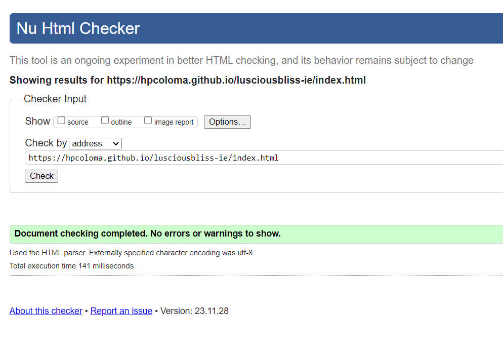

# **Luscious Bliss IE**

# Table of Contents

- **Project Introduction**
    - **Luscious Bliss IE**
    - **Link to live project**
    - **Objectives**
- **Planning Stage**
    - **User Goals**
    - **Site Owner Goals**
- **Design**
    - **Wireframes**
        - **Desktop Wireframes**
    - **Colour Scheme**
    - **Fonts**
    - **Imagery Used**
- **Features**
- **Technology Used**
    - **Language Used**
- **Testing**
    - **Code Validation**
    - **Resposiveness**

    

## **Project Introduction**
### Luscious Bliss IE
Luscious Bliss IE is an inspired baking business. Baking with love since 2021 from our small kitchen to your dining room, on all your occasion, satisfying your cravings while giving you a luxurious taste. 
### [Link to live project](https://hpcoloma.github.io/lusciousbliss-ie/)
### Objectives
## **Planning Stage**
### User Goals
- I want to know what the site is about?
- What products do you offer?
- Find out the location and contact information.
- How do you place an order.
### Site Owner Goals
- To showcase our existing products to both new and returning customers
- To create an online presence
- To order products by using the contact us form or via our social network pages
## **Design**
### Wireframes
- **Desktop Wireframes**
    - [Home](assets/readme/IndexWF.jpg)
    - [Products](assets/readme/ProductsWF.jpg)
    - [Contact Us](assets/readme/contactusWF.jpg)
### Colour Scheme
To come up with a colour combination, I searched for what is the best colour to match the name of my website. The colour deep purple comes up as the top search and to enhance the dark colour I added a touch of gold. When I searched for a palette, [Scheme Color](www.schemecolor.com) has the combination I was looking for.

I also checked the colour combination contrast on 
[Eightshapes Grid Contrast](https://contrast-grid.eightshapes.com/)

### Fonts
I wanted a plain Serif text that is easy to read. PT Serif is a transitional serif typeface with humanistic terminals. It is designed for use together with PT Sans, and is harmonized across metrics, proportions, weights and design. Fonts were downloaded from [Google Fonts](https://fonts.google.com/) 

### Imagery Used
Some of the images I used were downloaded from the web (list of websites below) and some are my own original photos. They were resized in [www.tinypng.com](www.tinypng.com) for easy loading of the website. I created the logo to match the color scheme I chose for my website.

- **Websites source for images**
    - [www.pexels.com](www.pexels.com)
    - [www.pinimg.com](www.pinimg.com)
    - [www.bing.com](www.bing.com)
    - [www.tasteofhome.com](www.tasteofhome.com)
    - [www.carlsbadcravings.com](www.carlsbadcravings.com)
    - [www.shugarysweets.com](www.shugarysweets.com)

## **Features**
- Header - Contains three menu items. Navigation bar should be available on all pages.

- Hero Image & Text - The hero image showcase the top best seller product and the text best describe our products.

- Best Seller section - show the top 3 products that customers always order.

- Testimonials section - these are endorsement from happy and returning customers, who validate the worth of our product.

- Footer section - shows contact information and links to our social media pages

- Products page - gives you all the products we bake.

- Contact Us page provides you a form to complete for you to place the order or ask a questions. You can also see more contact information.

- The aim is to makew the website responsive to mobile devices first and the style for all other devices will be added to make it responsive to all devices.
- Photos will be reduced in size but not in quality for faster loading.
- All sections are responsive to different device size.

## **Technology Used**
- **Language**
    - HTML
    - CSS3
- **Frameworks, Libararies & Programs**
    - Photoshop was used to create the logo and wireframes.
    - [Google Fonts](www.googlefonts.com) to import PT Serif to the stylesheet.
    - [Font Awesome](www.fontawesome) for footer and contact information icons.
    - [GitHub](www.github) for hosting project codes, maintaining repository.
    - [Codeanywhere](www.codeanywhere.com) I initially used this to build my project but find it very slow a lot of times, it takes time for the updates to take effect and longer time to load my workspace.
    - [Gitpod](www.gitpod) I switch to Gitpod and find it easier to use and faster.
    - [Favicon](www.favicon.io) to create favicon for my title.
    - [Am I Responsive](https://amiresponsive.co.uk/) to show the image of the website on different device size.

## **Testing**
- **Code Validation**
    - [W3C Validator](https://validator.w3.org/#validate_by_input) for HTML validation.
        - Home Page
        
        - Products
        
        - Contact Us
        
    - [W3c Validator](https://jigsaw.w3.org/css-validator/) for CSS validation.
        [Results](https://jigsaw.w3.org/css-validator/validator?uri=https%3A%2F%2Fhpcoloma.github.io%2Flusciousbliss-ie&profile=css3svg&usermedium=all&warning=1&vextwarning=&lang=en)
- **Contrast Grid**
    - [Eightshapes Grid Contrast](https://contrast-grid.eightshapes.com/) for checking the colour contrast of my colour palette.
- **Responsiveness**
- **Manual Testing**

 
 
